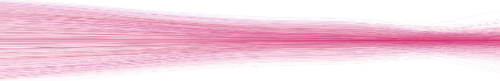
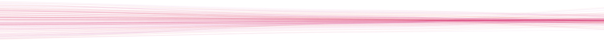

## Hi there, I'm Stefan 👋

I am an AI/ML research engineer working in precision oncology and bioinformatics, currently AI (Life Sciences) Lead at [BIO4 Campus](https://bio4campus.rs) in Belgrade, where I lead AI/ML strategy and build computational infrastructure for genomics and clinical machine learning. In parallel I am an ML Engineer in the field of bioinformatics. Ex-intern at [Microsoft](https://www.microsoft.com/). I hold an MPhil in Advanced Computer Science from the [University of Cambridge](https://www.postgraduate.study.cam.ac.uk/courses/directory/cscsmpacs), where I worked with Prof. [Pietro Lio](https://www.cst.cam.ac.uk/people/pl219) and Dr. [Sarah Teichmann](https://www.sanger.ac.uk/person/teichmann-sarah/) from the [Wellcome Sanger Institute](https://www.sanger.ac.uk/) on graph neural networks for single-cell multiomics. Before Cambridge, I completed an MSc in Data Science specialising in computational biology. My current work is in tumour growth modelling, deep learning solvers for brain tumour dynamics, and digital twins for CNS malignancies.

- 📫 How to reach me: [Website](https://stefan-m.com/) | [LinkedIn](https://www.linkedin.com/in/stefan-milosevic-1034b21a3) | [Google Scholar](https://scholar.google.com/citations?hl=en&user=lpkOiTgAAAAJ) | [X](https://x.com/milostefann) | [Email](mailto:sm2731@cantab.ac.uk)

